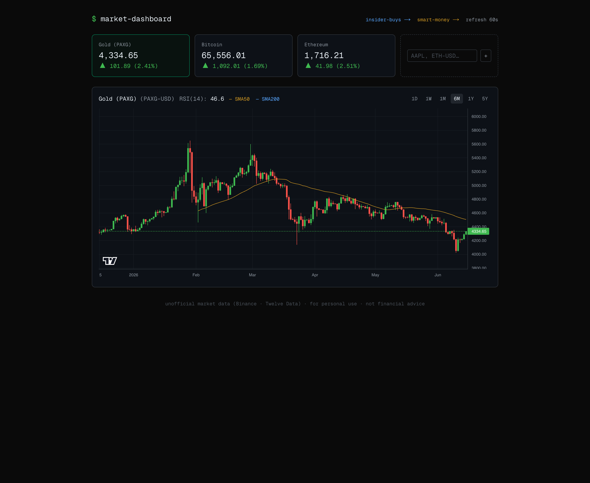
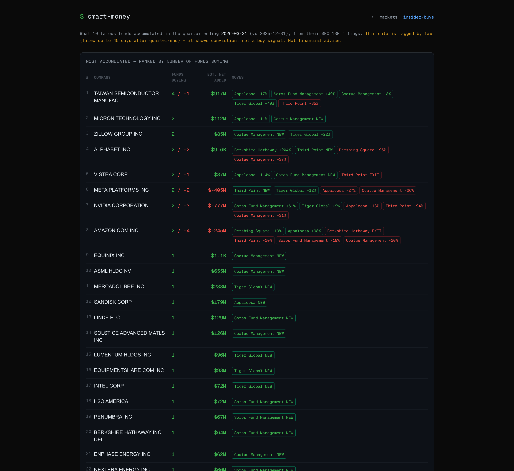
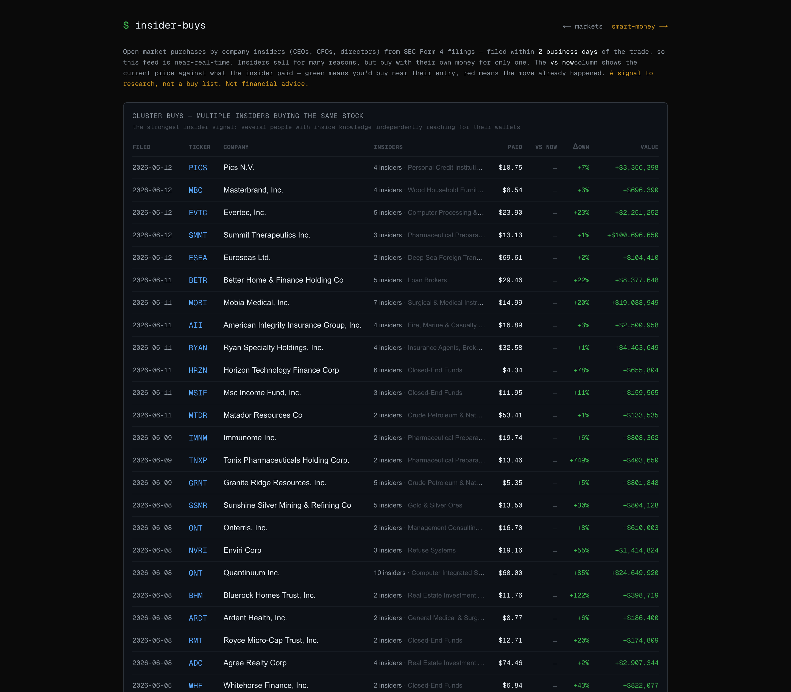

# Market Dashboard

[](https://github.com/hkgunawan/market-dashboard/actions/workflows/ci.yml)

A personal markets terminal I built to track the things I actually watch — gold, Bitcoin, and the indices — in one place, alongside what institutional "smart money" is quietly doing. Three views at three speeds: live prices, near-real-time insider buys, and quarterly hedge-fund accumulation.

Built with Next.js 16, React 19, TypeScript and Tailwind CSS. The core features run with **zero configuration and no API keys.**



## What it does

**📈 Markets** — a live watchlist (gold, Nasdaq 100, BTC by default; add any stock or crypto). Price cards with day change, candlestick charts via [lightweight-charts](https://github.com/tradingview/lightweight-charts), SMA 50/200 overlays and RSI(14), across 1D–5Y ranges. Auto-refreshes every 60s.

**🟡 Smart Money** — parses **SEC EDGAR 13F filings** from 10 famous funds (Berkshire, Pershing Square, Scion, Appaloosa, Tiger Global, …), diffs each fund's two most recent quarters, and ranks which stocks they accumulated — by number of funds buying and estimated net dollars moved. Resolves each holding's CUSIP→ticker (OpenFIGI) to show the **quarter-end price level they held at vs. the current price** — *did it already run up?* — with each ticker linking to its chart. A conviction signal, lagged by law.



**🔵 Insider Buys** — near-real-time **SEC Form 4** open-market purchases by company insiders. Cluster-buy detection (multiple insiders buying the same stock) plus a "vs now" column comparing the current price to what the insider paid — *am I early, or already late?* Click any ticker to jump straight to its chart on the markets page.



The three views deliberately map to three data speeds: **markets** (seconds) · **insider buys** (~2 days) · **smart money** (quarterly).

## Architecture

A provider-facade data layer keeps the browser talking only to the app's own API routes; each route caches aggressively (TTL + stale-on-error) so UI polling never bursts the upstream rate limits.

```
Browser ──> /api/quotes      ┐
        ──> /api/history      ┤
        ──> /api/smart-money  ┼─> lib/market.ts   facade + TTL cache
        ──> /api/insider-buys ┤        ├─ lib/binance.ts      crypto  (X-USD → XUSDT, incl. PAXG gold)
        ──> /api/brief        ┘        ├─ lib/twelvedata.ts   stocks / ETFs / XAU-USD (key-gated)
                                       └─ lib/yahoo.ts        fallback
                              lib/edgar.ts        SEC EDGAR 13F-HR + OpenFIGI CUSIP→ticker (smart money)
                              lib/openinsider.ts  SEC Form 4        (insider buys)
                              lib/indicators.ts   SMA / RSI math
```

Design notes:
- **Graceful degradation** — crypto + gold work with zero keys (Binance); stocks light up when a free Twelve Data key is added; the AI brief when an Anthropic key is added.
- **Resilience** — TTL cache with stale-on-error fallback, 429 backoff, and sequential fan-out to respect upstream rate limits.
- **Indicator math server-side** — SMA/RSI computed on the server, not shipped to the client.
- **Tested** — the indicator math, the 13F conviction-scoring/diff, and the filing parsers are covered by unit tests (Vitest), run on every push via GitHub Actions.

## Tech stack

Next.js 16 (App Router) · React 19 · TypeScript · Tailwind CSS v4 · lightweight-charts · SEC EDGAR + Binance + Twelve Data APIs.

## Run it

```bash
npm install
npm run dev    # dev server at http://localhost:3000
npm test       # run the unit test suite
```

Works out of the box (crypto + gold via Binance; smart-money + insider data via SEC). Optional keys in `.env.local`:

```
TWELVEDATA_API_KEY=...   # free at twelvedata.com — enables stocks, ETFs (e.g. QQQ) and spot gold XAU/USD
ANTHROPIC_API_KEY=...    # enables the AI daily brief
```

## Disclaimers

Unofficial data sources, personal use only. **Not financial advice** — this is a research and viewing tool; it does not predict anything, and all data shown is informational.
